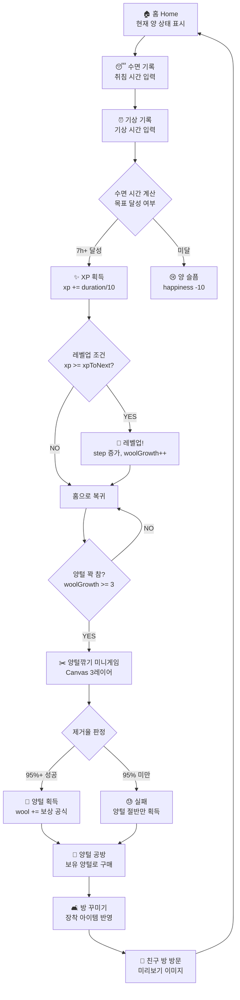

# Sleepy Sheep — 구현 계획서 v2

힐링형 수면 메이트 웹앱. 양 캐릭터를 키우며 수면 습관을 기르는 게임형 앱.  
기술: **HTML · CSS · JavaScript (ES6 Module)** · Canvas · LocalStorage

---

## 프로젝트 원칙 (Project Rules)

> [!IMPORTANT]
> 아래 원칙은 모든 코드 작성 시 반드시 준수한다.

| 원칙 | 내용 |
|------|------|
| **모듈화** | 모든 JS는 ES6 Module (`type="module"`) 사용 |
| **전역 최소화** | `window.*` 전역 변수 사용 금지. 모듈 간 통신은 import/export |
| **단일 책임** | 함수 하나는 하나의 역할만 수행 |
| **DOM 캡슐화** | DOM 조작은 해당 모듈 내부에서만 수행 |
| **네이밍** | CSS 클래스: `kebab-case` / JS 변수·함수: `camelCase` / 상수: `UPPER_SNAKE_CASE` |
| **경로 통일** | 이미지는 `assets/sheep/[step]/[pose].svg` 하위로 통일 |
| **키 관리** | localStorage 키는 `js/constants.js`의 `STORAGE_KEYS`로만 참조 |
| **이벤트** | 중복 이벤트 등록 방지: `addEventListener`는 초기화 함수에서 1회만 |

---

## UI 일관성 규칙

모든 UI 컴포넌트는 아래 스타일을 공유한다.

```css
/* 버튼 공통 */
border-radius: 20px;
transition: all 0.25s ease;
backdrop-filter: blur(12px);
box-shadow: 0 4px 20px rgba(0,0,0,0.15);

/* hover */
transform: scale(1.03);
box-shadow: 0 6px 28px rgba(0,0,0,0.22);

/* Glassmorphism 카드 */
background: rgba(255,255,255,0.08);
border: 1px solid rgba(255,255,255,0.15);
border-radius: 24px;
backdrop-filter: blur(16px);
```

### 색상 팔레트 (캐릭터 시트 기준)
| 토큰 | HEX | 용도 |
|------|-----|------|
| `--color-wool` | `#FFF7EE` | 양털 기본색 |
| `--color-wool-warm` | `#FFE6C4` | 양털 따뜻한 톤 |
| `--color-wool-skin` | `#FFD9A6` | 얼굴/배 |
| `--color-face` | `#F0E7DA` | 얼굴 크림 |
| `--color-lavender` | `#E5DDF2` | 배경 포인트 |
| `--color-purple` | `#BBD6FF` | 포인트 블루 |
| `--color-blue-soft` | `#A78BFA` | 보라 포인트 |
| `--color-night` | `#8B6B4F` | 다크 브라운 |
| `--color-dark` | `#565656` | 텍스트 |
| `--color-bg-night` | `#1a1a3e` | 밤하늘 배경 |

### 폰트
- **메인**: Nunito (Google Fonts) — 둥근 느낌
- **숫자**: Nunito — weight 700

---

## 성장 단계 정의 (10단계)

| STEP | 이름 | XP 요구 | 설명 | 양털 상태 |
|------|------|---------|------|----------|
| 1 | 새끼양 | 0 | 아주 작고 솜털이 거의 없음 | 민둥민둥 |
| 2 | 솜털양 | 100 | 작은 솜털이 조금 생김 | 솜털 조금 |
| 3 | 통통양 | 250 | 몸이 동그래지기 시작 | 털 조금 자람 |
| 4 | 포실양 | 450 | 털이 점점 풍성해짐 | 털 반쯤 |
| 5 | 뭉실양 | 700 | 털이 뭉게구름처럼 | 뭉실뭉실 |
| 6 | 구름양 | 1000 | 구름 같은 털 | 털 꽤 많음 |
| 7 | 복슬양 | 1350 | 털이 풍성하고 복슬복슬 | 복슬복슬 |
| 8 | 솜구름 | 1750 | 커다란 솜구름 같음 | 아주 풍성 |
| 9 | 털뭉치 | 2200 | 털이 몸의 대부분 | 거대 털뭉치 |
| 10 | 성체양 | 2700 | 풍성한 성체, 왕관급 | 최대 풍성 |

### 각 단계의 포즈 (이미지 목록)

각 STEP마다 아래 8가지 포즈 SVG/PNG 필요:

| 포즈 키 | 설명 | 사용 화면 |
|---------|------|----------|
| `idle` | 기본 대기 (정면) | 홈, 내 양 |
| `happy` | 행복 표정 ✨ | 수면 성공 보상 |
| `sleep` | 자는 모습 💤 (옆으로 누움) | 홈 취침 중, 친구 방 |
| `pet` | 쓰다듬기 (손 + 하트) | 상호작용 |
| `eat` | 먹이 먹기 (당근/사과 들고) | 상호작용 |
| `sad` | 슬픔 (눈물) | 수면 부족 |
| `shear` | 양털깎기 전 (털 가득) | 미니게임 woolCanvas |
| `shear_after` | 양털깎기 후 (민둥) | 미니게임 bodySheep |

> [!NOTE]
> 1단계 구현 시 SVG inline으로 `idle`, `sleep`, `shear`, `shear_after` 우선 제작.  
> 나머지 포즈는 CSS 표정 변형(filter, transform)으로 임시 대체.

---

## LocalStorage 데이터 구조

```js
// js/constants.js
export const STORAGE_KEYS = {
  SHEEP:    'ss_sheep',
  SLEEP:    'ss_sleep',
  ITEMS:    'ss_items',
  FRIENDS:  'ss_friends',
  SETTINGS: 'ss_settings',
  ROOM:     'ss_room',
};
```

### `ss_sheep` — 양 상태
```json
{
  "name": "음매",
  "level": 1,
  "xp": 0,
  "xpToNext": 100,
  "step": 1,
  "wool": 0,
  "woolGrowth": 0,
  "happiness": 100,
  "hunger": 100,
  "lastPetAt": null,
  "lastFedAt": null,
  "shearedAt": null,
  "canShear": false,
  "totalSleepDays": 0,
  "streak": 0
}
```

### `ss_sleep` — 수면 기록
```json
[
  {
    "date": "2026-07-03",
    "bedtime": "23:18",
    "wakeTime": "06:50",
    "duration": 452,
    "mood": 5,
    "note": "",
    "xpGained": 45,
    "woolGained": 3
  }
]
```

### `ss_items` — 아이템 소유/장착
```json
{
  "owned": ["item_ribbon_red", "item_hat_star"],
  "equipped": {
    "ribbon":     "item_ribbon_red",
    "hat":        null,
    "scarf":      null,
    "cushion":    null,
    "carpet":     null,
    "light":      null,
    "window":     null,
    "wallpaper":  null,
    "furniture":  null,
    "background": "bg_night_default"
  }
}
```

### `ss_friends` — 친구 목록 (더미)
```json
[
  {
    "id": "friend_001",
    "name": "나졸려",
    "level": 5,
    "step": 4,
    "isSleeping": true,
    "lastSeen": "2026-07-03T22:30:00",
    "room": {
      "background": "bg_night_purple",
      "carpet": "item_carpet_star",
      "ribbon": "item_ribbon_pink",
      "light": "item_light_moon"
    }
  }
]
```

### `ss_settings` — 앱 설정
```json
{
  "darkMode": true,
  "notification": true,
  "bgMusic": false,
  "vibration": true,
  "sleepGoal": 480,
  "wakeAlarm": "07:00",
  "bedAlarm": "22:30"
}
```

### `ss_room` — 내 방 상태
```json
{
  "background": "bg_night_default",
  "carpet": null,
  "furniture": [],
  "decorations": []
}
```

---

## 페이지 흐름 (State Flow)



---

## 미니게임 보상 공식

### Canvas 레이어 구조
```
z-index 낮음 ──────────────────── z-index 높음
[bodySheep Canvas]  [woolCanvas]  [clipperOverlay]
  → 항상 보임        → destination-out 적용    → 바리깡 커서
```

### 제거율에 따른 보상
| 제거율 | 보상 | 비고 |
|--------|------|------|
| 95 ~ 97% | 기본 양털 | `floor(step × 8)` g |
| 98 ~ 99% | 보너스 양털 | `floor(step × 10)` g |
| 100% | 완벽 깎기! | `floor(step × 12)` g |
| 95% 미만 | 실패 | `floor(step × 3)` g (위로 보상) |

**공식 요약**: `획득 양털 = 제거율 보너스 계수 × 성장단계(step)`

### 성공 처리 흐름
```js
// 성공 시
sheep.wool += reward;
sheep.xp = 0;           // XP 초기화
sheep.woolGrowth = 0;   // 양털 성장도 초기화
sheep.canShear = false;
sheep.shearedAt = new Date().toISOString();
saveToStorage(STORAGE_KEYS.SHEEP, sheep);
navigate('home');
```

---

## 파일 구조 (최종)

```
SheepShip_v0.1.0_Fresh/
├── index.html                  ← 메인 홈
├── css/
│   ├── variables.css           ← 색상·폰트·간격 토큰
│   ├── style.css               ← 전역 스타일 + 밤하늘 배경
│   ├── layout.css              ← .phone, .header, .bottom-nav
│   ├── components.css          ← .glass, 버튼, 프로그레스바, 스위치
│   ├── animations.css          ← 별, 양 float, 페이지 전환
│   └── responsive.css          ← 미디어 쿼리
├── js/
│   ├── constants.js            ← STORAGE_KEYS, GROWTH_TABLE, POSES
│   ├── storage.js              ← get/set/init localStorage 래퍼
│   ├── sheep.js                ← 양 상태, XP, 레벨, 표정/행동
│   ├── sleep.js                ← 수면 기록, 통계, 그래프
│   ├── minigame.js             ← Canvas 양털깎기 미니게임
│   ├── shop.js                 ← 상점 아이템, 구매, 장착
│   ├── room.js                 ← 방 꾸미기 렌더링
│   ├── friends.js              ← 친구 목록 + 더미 데이터
│   └── app.js                  ← 페이지 진입점 라우터
├── pages/
│   ├── home.html               ← [MODIFY] 완성
│   ├── sheep.html              ← [MODIFY] 완성
│   ├── sleep.html              ← [MODIFY] 완성
│   ├── workshop.html           ← [MODIFY] 완성
│   ├── minigame.html           ← [NEW]
│   └── friends.html            ← [NEW]
└── assets/
    └── sheep/
        ├── step1/
        │   ├── idle.svg
        │   ├── sleep.svg
        │   ├── shear.svg
        │   └── shear_after.svg
        ├── step2/ ... step10/
        └── ui/
            └── friend_room_preview.png  ← 친구 방 미리보기 이미지
```

---

## 친구 방 기능 (프로토타입)

> [!NOTE]
> LocalStorage 기반이므로 실제 멀티플레이어 없음.  
> **1단계**: 더미 데이터 + 정적 미리보기 이미지로 구현.  
> **추후 확장**: Firebase Realtime DB 연동 가능한 구조로 설계.

### 친구 방 표시 로직
```js
// friends.js
function renderFriendRoom(friend) {
  if (friend.isSleeping) {
    // 🌙 [이름]님의 침실
    // → 밤 배경 + 양 sleep 포즈 + 방 꾸미기 아이템
    // → 현재는 정적 이미지(friend_room_preview.png) 표시
  } else {
    // 💬 [이름]님의 방
    // → 낮 배경 + 양 idle 포즈
  }
}
```

### 친구 방 UI 구성
- 상단: `🌙 나졸려 님의 침실`
- 중앙: 밤 배경 방 안에 양 `sleep` 포즈 + 장착 아이템(리본, 방석 등)
- 하단: `방문 날짜`, `연속 수면일` 표시
- **사용자 아바타는 등장하지 않음 — 양과 방 꾸미기만 표시**

---

## Verification Plan

### 상태 전환 검증
- [ ] `취침 기록 → 기상 기록 → XP 증가` 흐름
- [ ] `XP >= xpToNext → 레벨업 → step 증가 → 양 이미지 변경`
- [ ] `woolGrowth >= 3 → 양털깎기 버튼 활성화`
- [ ] `95% 달성 → wool 획득 → 상점 반영`
- [ ] `상점 구매 → ownedItems 저장 → 방 꾸미기 반영`
- [ ] `localStorage 새로고침 후 전 상태 복원`

### UI 검증
- [ ] Glassmorphism 카드, 별 반짝임 애니메이션
- [ ] 모바일(390px) 레이아웃 이상 없음
- [ ] 하단 네비게이션 활성 탭 표시
- [ ] hover scale 1.03, transition 0.25s 동작
- [ ] 양 캐릭터 SVG — step별 크기/털 차이 시각적으로 구분

---

## 구현 순서

> [!IMPORTANT]
> 아래 순서대로 진행한다. 각 단계 완료 후 다음 단계로 이동.

```
Phase 1: CSS 디자인 시스템 (variables → style → layout → components → animations)
Phase 2: JS 기반 모듈 (constants → storage → sheep → sleep)
Phase 3: 메인 페이지 (index.html, home.html 완성)
Phase 4: 내 양 · 수면 기록 페이지
Phase 5: Canvas 미니게임 (minigame.html + minigame.js)
Phase 6: 양털 공방 (workshop.html + shop.js)
Phase 7: 친구 화면 프로토타입 (friends.html)
Phase 8: app.js 라우터 통합 + 전체 QA
```
